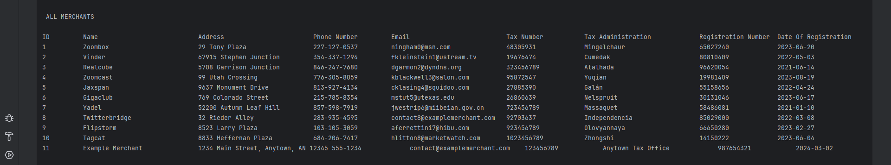
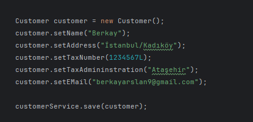
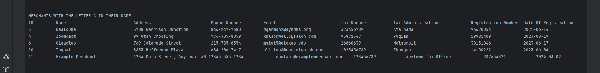
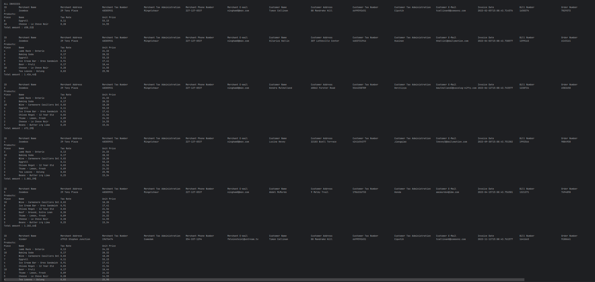
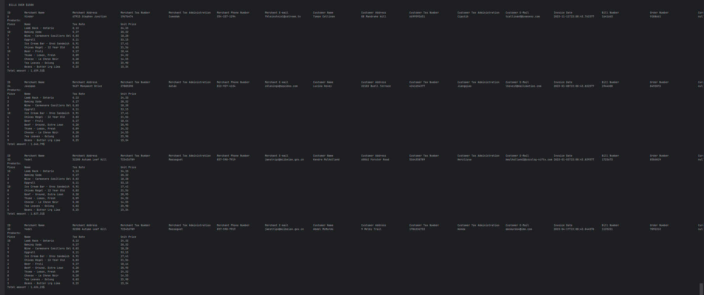
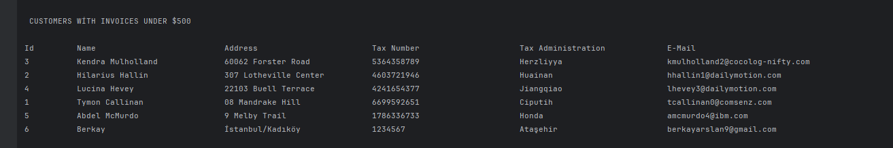
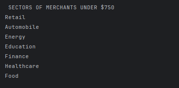

# CUSTOMER INVOICE MANAGEMENT SYSTEM

## Overview
The Customer Invoice Management System is a comprehensive Spring Boot application designed to manage the invoicing process for businesses efficiently. It streamlines the handling of customer information, product catalog, merchant details, and invoice generation, offering a robust backend system for businesses looking to digitize their financial transactions.

## Features:

- Customer Management: Allows for the addition, update, and retrieval of customer information, including details like name, address, tax number, and contact information.
- Product Catalog: A comprehensive system to manage product listings, including descriptions, unit prices, and tax rates, facilitating easy invoice generation.
- Invoice Processing: Enables the creation of detailed invoices, associating them with specific customers and products, including the calculation of total amounts with applicable taxes.
- Merchant Management: Merchants can manage their information, including tax details and contact information, enhancing the system's utility for multiple business entities.
- Data Integrity and Security: Implements robust data validation and error handling to ensure data integrity and security.
- Reporting and Analytics: Provides functionality to generate reports and analytics, such as average invoice amounts, invoices over a certain price, and merchant-specific transactions.

## Technology Stack
This project is built with the following technologies:

- Spring Boot: For creating the backend application. Version: 3.2.3
- H2 Database: An in-memory database for storing the data
- JPA & Hibernate: For ORM and database interaction
- Spring Data JPA: To simplify data access layers
- Lombok: To reduce boilerplate code for model/data objects

## Getting Started
Prerequisites
Before you begin, ensure you have the following installed:

- Java JDK 21 or later
- Maven 4.0.0 or later

## Some Sample Features

- List All Merchants
  

- Create a new customer

  

- List customers with the letter 'C' in them

  

- List the total amount of invoices of customers who registered in June

  

- List all invoices in the system
  

- Listing invoices over $1500 in the system

  

- Calculating the average of invoices over $1500 in the system

  

- List customers with invoices under $500 in the system

  

- List the industry in which companies whose average invoices for June were below $750

  
